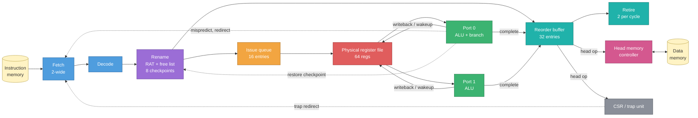

# Speculative Out-of-Order RV32I Processor

A two-wide, speculative, out-of-order RISC-V core written from scratch in
SystemVerilog, taken from RTL through verification toward a LibreLane GDSII
implementation.

## Introduction

This is an open-source learning project. I'm building it to understand how
out-of-order (OoO) CPUs really work by designing, verifying and eventually
taping out one myself. The code, diagrams and verification flow are public, so
anyone studying CPU microarchitecture can read along.

**What does an out-of-order CPU do?** A simple CPU runs instructions strictly one
after another. When one instruction waits, for example on a slow memory load,
everything behind it waits too. An OoO CPU looks ahead and runs any later
instruction whose inputs are already ready, so the hardware stays busy. To keep
the program correct, it:

1. **Renames registers** so that unrelated instructions that reuse the same
   register name don't block each other.
2. **Speculates** past branches by guessing the outcome. On a wrong guess it
   throws away the wrong-path work and recovers.
3. **Retires in order** through a reorder buffer (ROB), so results, traps and
   memory writes become visible exactly as a sequential program would produce
   them.

### Simplified architecture



Solid arrows are data flow and dotted arrows are recovery or redirect. See the
[detailed RTL diagram](docs/diagrams/rtl-overview.svg) and the
[architecture guide](docs/architecture.md) for the real module hierarchy.

## Highlights

- **Out-of-order execution:** register renaming onto a 64-entry physical register
  file, a 16-entry issue queue with wakeup/select, and two integer execution ports.
- **Speculation and recovery:** execution past unresolved branches, with 8 rename
  checkpoints for misprediction recovery.
- **Precise state:** a 32-entry reorder buffer retires up to two instructions per
  cycle in program order. It also handles precise traps, CSRs, MRET and WFI.
- **Memory path:** loads, stores and FENCE run at the ROB head, with alignment and
  PMA checks, MMIO ownership and committed-store draining.
- **Verification:** directed and random RTL testbenches, Spike lockstep reference
  checks, mutation checks, focused SymbiYosys formal proofs, and synthesis gates
  for each block.

| Resource | Configuration |
| --- | --- |
| ISA | RV32I + Zicsr + Zifencei, machine mode |
| Fetch / rename width | 2 instructions |
| Issue queue | 16 entries, 2 ports (ALU + branch, ALU) |
| Physical registers | 64 tags, 4 read / 2 write ports |
| Reorder buffer | 32 entries, 2 retirements per cycle |
| Branch recovery | 8 checkpoints, static not-taken prediction |

These are hardware capacities, not measured IPC or frequency figures.

## Status

| Area | Status |
| --- | --- |
| Integer, branch, CSR and trap execution | Working and verified at the core level |
| Head-only loads, stores and FENCE | Working behind `MEMORY_SERVICE=1` |
| Load/store queue, forwarding, caches, dynamic prediction | Planned |
| Full-core timing and LibreLane GDSII | Planned |

## Quick start

You need Python 3, GNU Make, a C++ toolchain, Verilator and the
[OSS CAD Suite](https://github.com/YosysHQ/oss-cad-suite-build).

```sh
export OSS_CAD_SUITE=/path/to/oss-cad-suite
make system-core-check   # fetched integer/control/system core
make memory-core-check   # core with loads, stores and FENCE
```

See [verification](docs/verification.md) for the full set of gates and the
reference-model setup.

## Documentation

- [Architecture](docs/architecture.md): microarchitecture, memory subsystem,
  ISA support and diagrams.
- [Verification](docs/verification.md): toolchain, check commands and their scope.
- [References](docs/references.md): specifications, papers and tools that
  informed the design.

## Repository layout

| Path | Purpose |
| --- | --- |
| [`rtl/`](rtl/) | SystemVerilog modules (frontend, backend, execute, core) |
| [`verif/`](verif/) | Testbenches, reference models and formal harnesses |
| [`config/`](config/) | Platform definition, interface contracts and tool pins |
| [`tools/`](tools/) | Generation and verification runners |
| [`docs/`](docs/) | Architecture documentation and diagrams |

## Author

**Nguyen Ngoc Huy**:
[LinkedIn](https://www.linkedin.com/in/nguyen-ngoc-huy-119027380/) ·
[Email](mailto:huynguyenngoccbg@gmail.com) ·
[Portfolio](https://portfolio-h-huy.vercel.app/)
