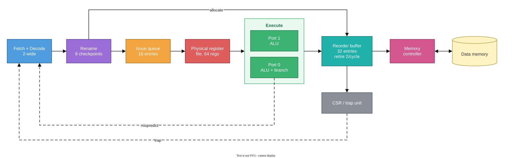

# Speculative Out-of-Order RV32I Processor

A two-wide, speculative, out-of-order RISC-V core in SystemVerilog. I'm building
it to learn how these CPUs work, and the goal is a LibreLane GDSII layout.

## How an out-of-order CPU works

A simple CPU runs instructions one at a time, so a slow load holds up everything
behind it. An out-of-order core runs whatever is ready. Three ideas keep that correct:

- Register renaming: instructions that reuse a register name get different
  physical registers, so they stop blocking each other.
- Speculation: guess the branch direction and keep going. If wrong, drop the
  younger work and restore the old state.
- In-order retirement: a reorder buffer (ROB) commits results in program order,
  so traps and memory writes look sequential.



Dashed arrows redirect fetch. Module-level detail is in
[architecture](docs/architecture.md).

| Idea | Size here | Source |
| --- | --- | --- |
| Renaming | 64 physical registers, 2 instructions per cycle | [`rename_state.sv`](rtl/backend/rename_state.sv) |
| Waiting for operands | 16-entry issue queue | [`issue_queue.sv`](rtl/backend/issue_queue.sv) |
| Speculation | 8 checkpoints, static not-taken prediction | [`rename_checkpoints.sv`](rtl/backend/rename_checkpoints.sv) |
| Retirement | 32-entry ROB, 2 retires per cycle | [`rob_two_wide.sv`](rtl/backend/rob_two_wide.sv) |
| Loads and stores | Run at the ROB head, no caches | [`head_memory_controller.sv`](rtl/core/head_memory_controller.sv) |

## Status

RV32I + Zicsr + Zifencei, machine mode. Integer, branch, CSR and trap execution
work and are verified at the core level. Loads, stores, FENCE and FENCE.I work
too, but only at the ROB head. Still to do: a load/store queue, caches, dynamic
prediction, full-core timing and the GDSII run. I haven't measured IPC or
frequency yet.

## Running it

Needs Python 3, GNU Make, a C++ toolchain, Verilator and the
[OSS CAD Suite](https://github.com/YosysHQ/oss-cad-suite-build).

```sh
export OSS_CAD_SUITE=/path/to/oss-cad-suite
make system-core-check   # integer, branch and trap core
make memory-core-check   # adds loads, stores and fences
```

More in [verification](docs/verification.md) and [references](docs/references.md).
Code is in `rtl/`, tests in `verif/`, interface contracts in `config/`.

## Author

Nguyen Ngoc Huy:
[LinkedIn](https://www.linkedin.com/in/nguyen-ngoc-huy-119027380/) ·
[Email](mailto:huynguyenngoccbg@gmail.com) ·
[Portfolio](https://portfolio-h-huy.vercel.app/)
