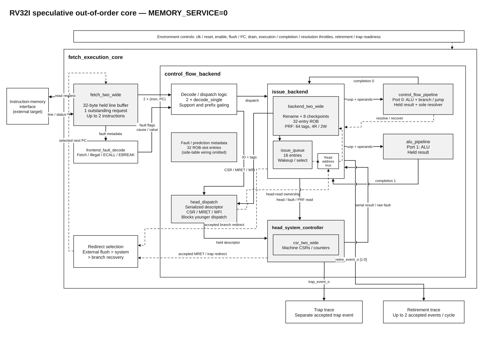
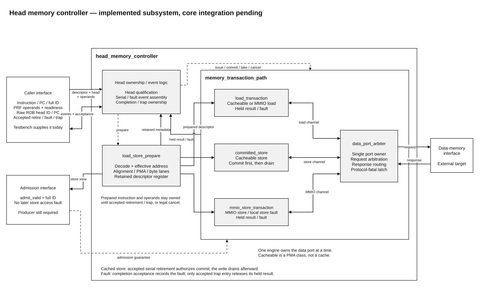

# Architecture

The diagrams show module hierarchy and interfaces, not clock-cycle stages. The
connected-core view is built with `MEMORY_SERVICE=0`
([`system_core`](../config/system_core.json) profile).

## Connected core

- Fetch ([`fetch_two_wide.sv`](../rtl/frontend/fetch_two_wide.sv)) holds one
  32-byte line and offers up to two instructions. It predicts PC+4 and a taken
  branch resolves on port 0. A redirect drops the buffered line.
- Rename and allocation take up to two instructions. A lane-0 branch or fault,
  a full resource or a system instruction can shorten the group.
- The issue queue wakes ops as operands arrive. Port 0 runs ALU and branch,
  port 1 runs ALU.
- The PRF has 64 tags and p0 is always zero. A ROB entry is a 5-bit slot plus
  an 8-bit generation.
- Faults (fetch, illegal, ECALL, EBREAK) ride through the ROB as resultless
  entries. The trap is taken when the entry reaches the head.
- CSR, MRET and WFI get a ROB entry alone, skip the issue queue and block
  younger allocation. They commit atomically at retirement.

If redirects collide, external flush beats system redirect, which beats branch
recovery. With memory off, loads, stores and fences stall allocation until a
redirect clears them.

## Head memory subsystem

With `MEMORY_SERVICE=1`, [`head_memory_controller`](../rtl/core/head_memory_controller.sv)
runs loads and stores only when they reach the ROB head with both operands ready.

- A load writes its destination at retirement.
- A cacheable store needs external admission, writes its bytes after retirement,
  and blocks the next memory op until the write drains. No cache exists yet.
- An MMIO store can't be undone, so external flush waits while one is in flight.
- One engine owns the data port at a time.

Details are in the [controller contract](../config/head_memory_controller.json).

## Fences

FENCE waits for older data accesses, including store write responses. FENCE.I
waits the same way, then refetches PC+4 and drops the fetch line. Neither does
anything else yet, since there are no caches.

## Diagram source

[`core.drawio`](diagrams/core.drawio): export page 1 to `rtl-overview.svg` and
page 2 to `head-memory-controller.svg`.
